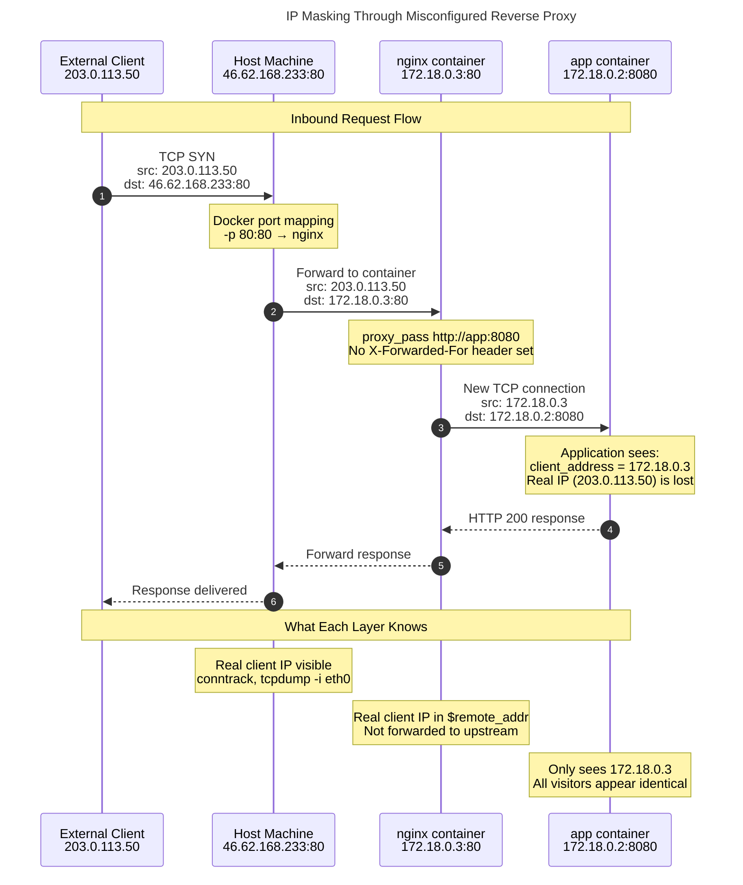

## The Problem

nginx receives the real IP but doesn't pass it to the backend:

```nginx
location / {
    proxy_pass http://app:8080;
    # Missing: proxy_set_header X-Forwarded-For $remote_addr;
}
```

## Deploy

```bash
curl -fsSL https://raw.githubusercontent.com/Achxy/aurora-autopsy/main/preliminary/analysis-1/setup.sh | bash
```

## Verify

```bash
docker compose logs -f app
```

All visitors appear as `172.18.0.x` (nginx's container IP).\

